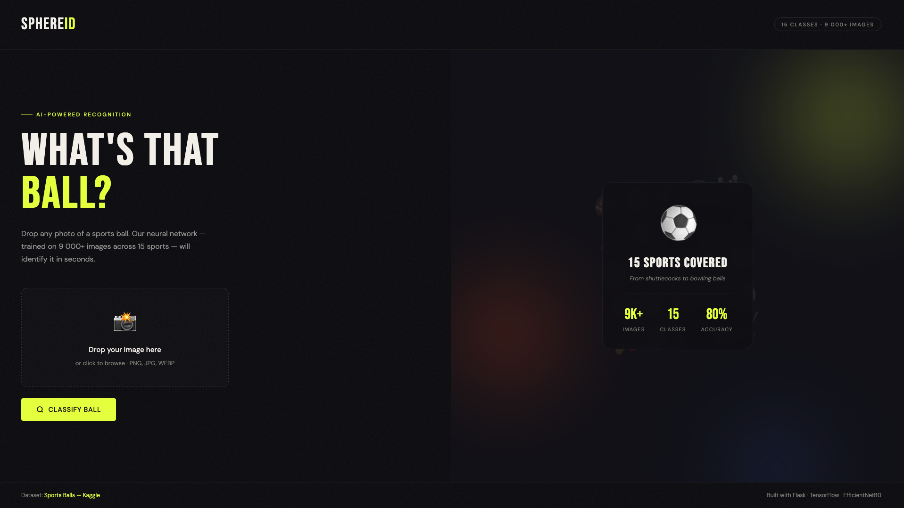
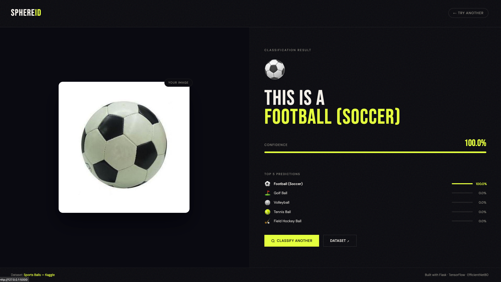

# ⚽ SphereID — Sports Ball Classifier

> A neural network–powered web app that identifies **15 types of sports balls** from a photo. Built with Flask + TensorFlow (EfficientNetB0 transfer learning).


---

## 📸 Screenshots

| Upload Page | Result Page |
|---|---|
|  |  |

---

## 🏅 Supported Classes

| Emoji | Class | Emoji | Class |
|-------|-------|-------|-------|
| 🏈 | American Football | 🎾 | Tennis Ball |
| ⚾ | Baseball | 🏐 | Volleyball |
| 🏀 | Basketball | 🏸 | Shuttlecock |
| 🎱 | Billiard Ball | 🏓 | Table Tennis Ball |
| 🎳 | Bowling Ball | ⛳ | Golf Ball |
| 🏏 | Cricket Ball | 🏑 | Field Hockey Ball |
| ⚽ | Football (Soccer) | 🏒 | Hockey Puck |
| 🏉 | Rugby Ball | | |

---

## 📂 Project Structure

```
sports-ball-classifier/
├── app.py                    # Flask app — routes & prediction logic
├── requirements.txt
├── model/
│   └── sports_ball_model.h5  # ← place for trained model
├── templates/
│   ├── index.html            # Upload page
│   └── result.html           # Prediction result page
└── README.md
```

---

## 🔗 Links

| Resource | Link |
|----------|------|
| 📦 Dataset (Kaggle) | [Sports Balls — Multiclass Image Classification](https://www.kaggle.com/datasets/samuelcortinhas/sports-balls-multiclass-image-classification) |
| 🧪 Training Notebook (Colab) | [Open in Google Colab](https://colab.research.google.com/drive/1QHW2sTkNMY_wWWfe4Lc9ehMXvfewZg2M?usp=sharing) |


---

## 🚀 Getting Started

### 1. Clone the repo

```bash
git clone https://github.com/MrEug3n1o/sports_classifier_ml.git
cd sports_classifier_ml
```

### 2. Create a virtual environment

```bash
python -m venv venv
source venv/bin/activate        # macOS / Linux
venv\Scripts\activate           # Windows
```

### 3. Install dependencies

```bash
pip install -r requirements.txt
```

### 4. Run the app

```bash
python app.py
```

Open [http://localhost:5000](http://localhost:5000) in your browser.

---


## 📦 Requirements

```
flask>=3.0
tensorflow>=2.13
pillow>=10.0
numpy>=1.24
werkzeug>=3.0
```

Install all at once:

```bash
pip install -r requirements.txt
```

---

## 🛠️ Tech Stack

| Layer | Technology |
|-------|-----------|
| Web framework | Flask 3.x |
| ML framework | TensorFlow 2.x / Keras |
| Model architecture | EfficientNetB0 |
| Training environment | Google Colab (T4 GPU) |
| Image processing | Pillow + NumPy |
| Frontend | Vanilla HTML/CSS/JS |
| Fonts | Bebas Neue + DM Sans |

---

## 📄 License

MIT License. Dataset is subject to [Kaggle's terms of service](https://www.kaggle.com/terms).